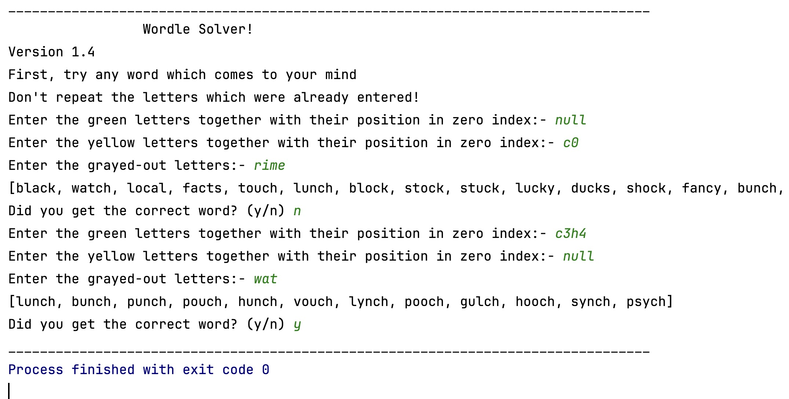

# Wordle Solver Program v1.5

## Overview

This Java-based Wordle solver program is designed to assist in solving Wordle puzzles. The v1.5 version introduces a Command-Line Interface (CLI) version executed through `UIConnector.java`.

## Algorithm

1. **Read Words from File:**
   - Words are read from the *"word_list.txt"* file and stored in an ArrayList.

2. **Create and Populate HashMap:**
   - A HashMap is created to map integer values to characters and is populated with the provided input.

3. **Green Selector:**
   - Takes the HashMap as input with letters and their corresponding positions.
   - Filters the ArrayList to keep only words that match the provided positions.

4. **Yellow Selector:**
   - Takes the HashMap as input with letters and their positions.
   - Ensures the letters are present somewhere in the word but not at the specified position.

5. **Eliminator:**
   - Takes a string as input and eliminates words containing the characters in the input string.

## CLI User Interface



## Running Instructions

Execute the following command in the terminal inside the project directory:

```bash
javac UIConnector.java && java UIConnector
```

### Contributing
This project is exclusively my creation, and I enthusiastically invite contributions from the community. If you wish to contribute, kindly adhere to the following guidelines:

1. Fork the repository.
2. Create a new branch for your feature or bug fix: `git checkout -b feature-name`.
3. Make your changes and commit them: `git commit -m 'Description of changes'`.
4. Push to the branch: `git push origin feature-name`.
5. Submit a pull request.

