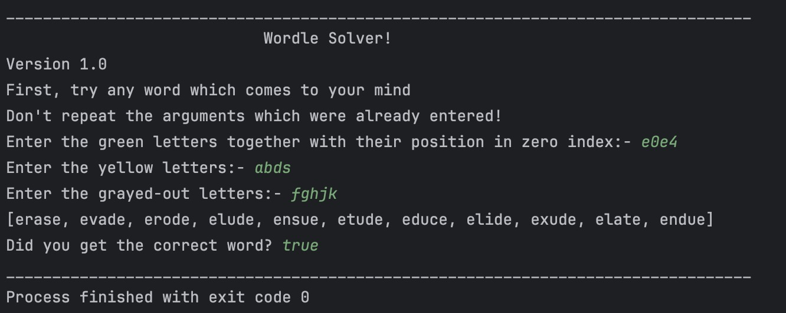

# Wordle solver program  v1.4

###### written in java

### To run v1.0 (cli based version) execute UIConnector.java

**Algorithm:**

1. Read words from the *"word_list.txt"* file and store them in an ArrayList.
2. Create a HashMap to map integer values to characters and populate the HashMap.
3. The *"green_selector"* takes the *HashMap* as input with letters and their corresponding positions then, it filters
   the arraylist to keep only words that match the provided positions.
4. The *"yellow_selector"* takes the *HashMap* as input with letters and their position, it makes sure the letters are
   present somewhere in the word but not at the specified position.
5. The *"eliminator"* takes string as the input and eliminates words containing the characters in the input string.

### CLI UI

## Running instructions:

Execute the following command on the terminal inside of the project directory:

``javac UIConnector.java && java UIConnector``

#### The search algorithm implemented in this project can be used to build a more general purpose word finder, here is the [list of all the words in english](https://raw.githubusercontent.com/dwyl/english-words/master/words.txt) for this project.
